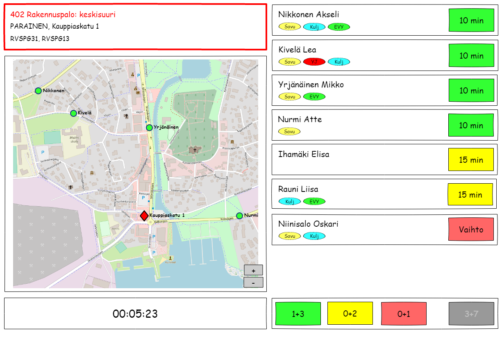

# Vepari UI Sketches

This page contains some rough UI sketches of the different user intefaces of Vepari. They are only mean to convey the general idea of what information and interactions the UI provides. The actual user interface will look different and may also include features not present or lack features present in the sketches.

## The Runboard

The runboard is an application running on big screen monitors at the fire station. The runboard can run in two modes: *alert* and *standby*.

### Alert mode

The runboard enters the alert mode whenever it receives a dispatch message from the Emergency Dispatch Center.

* At the top of the screen, you can see the type of incident, the incident address and the units from the own fire department that have been dispatched. 
  * There is a special kind of dispatch SMS you can order that includes the coordinates of the incident, which makes plotting on a map easier since you don't need to do an address lookup. However, since all SMS:es are cut after 160 characters, a lot of extra information will be lost (such as additional details or even the alerted units). Therefore, there is no point in showing this information in the runboard.
* The location of the incident is plotted on a map, but no routing is made.
  * In addition, you can see the real-time locations of all the people who are responding to this incident provided that they have enabled this feature in their mobile phone apps.
  * The map can be panned and zoomed if the runboard device is equipped with a mouse or other pointing device.
* There is a timer that shows the time since the alert was received. 
  * If the runboard screen is equipped with loudspeakers, it can be configured to sound a warning when a certain time has been reached (for example if the unit is supposed to be en route within 10 minutes, the warning could be configured to sound at 9 minutes).
* All the people responding to this particular incident are listed on the screen, ordered by which status they have provided.
  * In this example, there are three available statuses: one for people responding within 10 minutes (green), another for people responding withing 15 minutes (yellow) and a third for people that are not responding immediately but may be available for crew changes later (red).
  * The qualities of the responders are also shown. 
* At the bottom, there is a summary of the crew responding to this incident, grouped by status.
  * In this example, you can see that a crew of 1+3 will be at the station within 10 minutes, another 0+2 within 15 minutes and 0+1 on demand. 3+7 are not responding at all.
* The runboard will reset to standby mode after a configured timeout has been reached.
  * It can also be manually reset if the runboard device is equipped with a mouse or other pointing device.
* If another dispatch message is received while the runboard is in alert mode, the incident details and map information will change, but the responders and timer will remain unchained.
