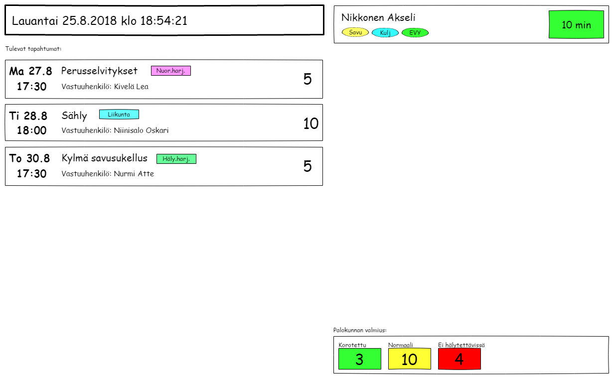

# User Interface Sketches

This page contains some rough UI sketches of the different user intefaces of Vepari. They are only mean to convey the general idea of what information and interactions the UI provides. The actual user interface will look different and may also include features not present or lack features present in the sketches.

## The Runboard

The runboard is an application running on big monitors at the fire station. The runboard can run in two modes: *alert* and *standby*.

### Alert mode

The runboard enters the alert mode whenever it receives a dispatch message from the Emergency Dispatch Center.

* At the top of the screen, you can see the type of incident, the incident address and the units from the own fire department that have been dispatched. 
  * There is a special kind of dispatch SMS you can order that includes the coordinates of the incident, which makes plotting on a map easier since you don't need to do an address lookup. However, since all SMS:es are cut after 160 characters, a lot of extra information will be lost (such as additional details or even the alerted units). Therefore, there is no point in showing this information in the runboard.
  * Different incident types have different colors. In this example, structural fires have the color red.
* The location of the incident is plotted on a map, but no routing is made.
  * In addition, you can see the real-time locations of all the people who are responding to this incident provided that they have enabled this feature in their mobile phone apps.
  * The map can be panned and zoomed if the runboard device is equipped with a mouse or other pointing device.
* There is a timer that shows the time since the alert was received. 
  * If the runboard screen is equipped with loudspeakers, it can be configured to sound a warning when a certain time has been reached (for example if the unit is supposed to be en route within 10 minutes, the warning could be configured to sound at 9 minutes).
* All the people responding to this particular incident are listed on the screen, ordered by which status they have provided.
  * In this example, there are three available statuses: one for people responding within 10 minutes (green), another for people responding withing 15 minutes (yellow) and a third for people that are not responding immediately but may be available for crew changes later (red).
  * The qualities of the responders are also shown. 
  * If the responders don't fit on the screen, the list will automatically scroll up and down.
* At the bottom, there is a summary of the crew responding to this incident, grouped by status.
  * In this example, you can see that a crew of 1+3 will be at the station within 10 minutes, another 0+2 within 15 minutes and 0+1 on demand. 3+7 are not responding at all.
* The runboard will reset to standby mode after a configured timeout has been reached.
  * It can also be manually reset if the runboard device is equipped with a mouse or other pointing device.
* If another dispatch message is received while the runboard is in alert mode, the incident details and map information will change, but the responders and timer will remain unchained.

### Standby Mode

The runboard is in standby mode by default.

* At the top of the screen, you can see today's date and the current time.
* Below the clock, there is a list of upcoming events.
  * You can see when, what, who is in charge and how many people are participating.
* The status screen is still visible on the right, just as in alert mode. If somebody was to send a status notification, it would show up here.
  * The reason for this is that it should be possible to track who is responding to an incident even if the runboard for some reason did not receive the dispatch message, or the dispatch message was malformed.
  * Status notifications received while in standby mode will be automatically cleared after some time.
  * Status notifications received while in standby mode will remain visible if the runboard switches to alert mode.
* At the bottom of the screen, you can see the current prepardness level of the entire fire department.
  * By default, every member's prepardness level is set to normal.
  * It is possible for members to raise their prepardness level for short periods of time, for example if they have agreed to be available to respond during a holiday when the rest of the department is off (such as midsummer's eve).
  * It is also possible for a member to go out of service, for example due to sickness or traveling.

## The Phone App

The phone app is an application running on each responder's Android phone (if they have one, that is). It is used for receiving dispatch notifications, sending status messages and very simple messaging. For more advanced messaging other existing solutions such as WhatsApp should be used.

The phone app will also include a login screen and a settings view for configuring the application (selecting alert sound and timeout, enabling or disabling location sharing, etc.), a menu for navigating between the views, etc. However, only the most important views are included below.

### Receiving an SMS Dispatch Message

* The app reacts when a dispatch message is received as an SMS from the Emergency Dispatch Center and will sound an alarm signal until the user reacts or some timeout is reached.
* The app parses the incident code from the message and looks up its description from a local database.
* The text message is shown as-is without any formatting.
* A timer shows the time elapsed since the message was received.
* Status buttons allow the responder to select a status.
* Above each status button is the number of responders who have selected that particular status.
* If the status message cannot be sent, e.g. because of a network error, the app will present the user with the option of calling a predefined number or sending the status as a text message instead.

### Receiving an App Dispatch Message

* The app reacts when the server broadcasts a limitied dispatch notification that includes only the incident code.
  * This is mainly intended for situations where a responder is not yet receiving official dispatch messages from the emergency dispatch center and as a backup solution in case some text messages were to be lost.
* Apart from the missing dispatch message, the app behaves in the same way as if it had received an SMS dispatch message.
* If an SMS dispatch message is received after the app dispatch notification, the message will shows up on the screen.
* If an app dispatch notification is received after the SMS dispatch message, nothing happens.

### Events

* It is possible to open a list of upcoming events in the app.
* Users can RSVP by pressing a button.
* The RSVP can be changed afterwards.

### Simple Messaging

* Short pre-defined messages can be sent out to certain groups of users.
* These messages can have predefined response options, such as 'Yes' and 'No' or 'Coming' or 'Not Coming'.
  * It is possible to see how many users have selected which option for each message.
* It is possible to add additional text to the message.

* If there are no response options, there is only an 'Acknowledge' button that allows the users to acknowledge that they have received and read the message.

* It is also possible to send out completely custom messages. In this case, there is a button to continue the discussion in some other messaging app, such as WhatsApp.

## To be continued...
